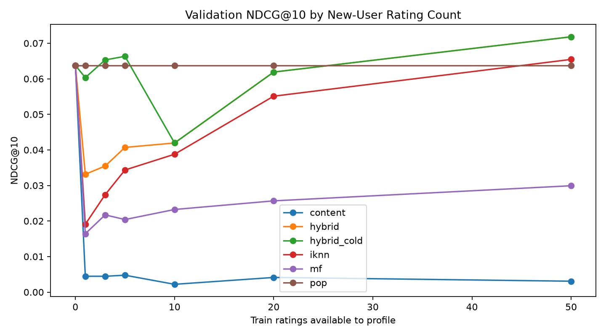
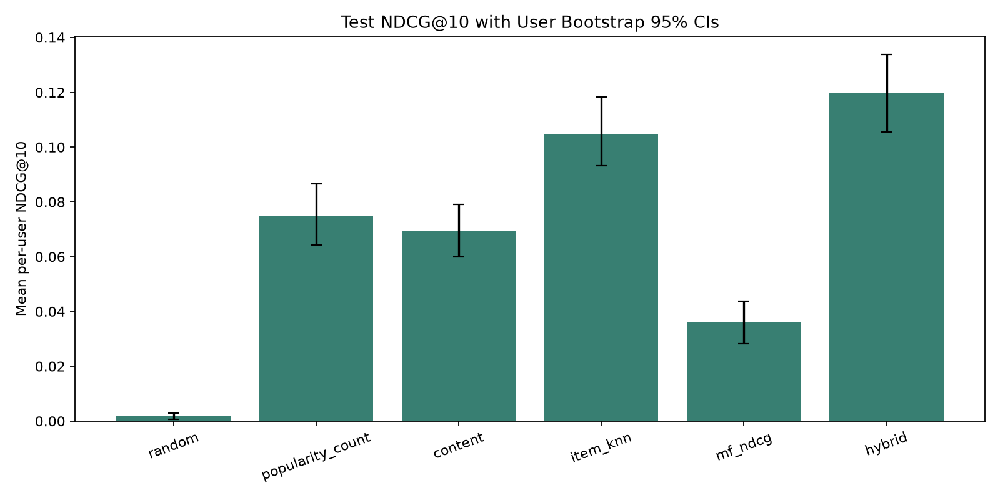

# CineMatch: hybrid movie recommender (content + collaborative + matrix factorization) with live demo

## 1. Demo
Live demo: <ADD URL AFTER DEPLOY>


I will add the demo GIF after deployment.

## 2. Results at a glance
Final test results (best ranking NDCG@10: implicit Item-kNN; best rating RMSE: Ridge hybrid stack):

| Model | RMSE | MAE | P@10 | R@10 | NDCG@10 | MAP@10 | Coverage | Novelty |
|---|---:|---:|---:|---:|---:|---:|---:|---:|
| bias | 0.9044 | 0.6986 | 0.0444 | 0.0324 | 0.0555 | 0.0248 | 0.0053 | 9.4159 |
| content | N/A | N/A | 0.0530 | 0.0518 | 0.0694 | 0.0307 | 0.0563 | 9.1851 |
| hybrid | N/A | N/A | 0.0922 | 0.0816 | 0.1196 | 0.0622 | 0.0482 | 9.1945 |
| hybrid_stack | **0.8767** | 0.6746 | N/A | N/A | N/A | N/A | N/A | N/A |
| item_knn | 0.8811 | **0.6737** | 0.0760 | 0.0698 | 0.1049 | 0.0535 | 0.0886 | 9.9647 |
| item_knn_implicit | N/A | N/A | **0.0954** | **0.0837** | **0.1231** | **0.0630** | 0.0550 | 9.5021 |
| mf | 0.8799 | 0.6754 | 0.0289 | 0.0154 | 0.0370 | 0.0173 | 0.0284 | 11.7842 |
| mf_ndcg | N/A | N/A | 0.0282 | 0.0154 | 0.0360 | 0.0160 | 0.0251 | 10.9591 |
| popularity_bayes | N/A | N/A | 0.0500 | 0.0384 | 0.0625 | 0.0285 | 0.0059 | 9.1719 |
| popularity_count | N/A | N/A | 0.0576 | 0.0483 | 0.0751 | 0.0360 | 0.0101 | 8.5714 |
| random | N/A | N/A | 0.0015 | 0.0012 | 0.0017 | 0.0005 | **0.4519** | **18.5310** |
| user_knn | 0.8866 | 0.6797 | 0.0699 | 0.0664 | 0.0910 | 0.0422 | 0.0813 | 10.0380 |
| user_knn_implicit | N/A | N/A | 0.0858 | 0.0800 | 0.1070 | 0.0536 | 0.0216 | 8.8247 |





## 3. Problem and dataset
CineMatch recommends unrated movies from explicit MovieLens ratings. MovieLens ml-latest-small has **610 users, 9,742 movies, and 100,836 ratings**; the user-movie matrix is **98.3032% sparse**. The long tail is pronounced: the top 975 movies (10% of the catalog) account for **60.10%** of ratings.

## 4. Methodology
- **Split:** per-user chronological temporal split, nominally 70/10/20. Sequential test-then-validation tails and per-user rounding yield 72,115 train, 8,304 validation, and 20,417 test rows (71.52/8.23/20.25%).
- **Models:** random and popularity baselines; regularized bias; TF-IDF content; residual/implicit Item- and User-kNN; biased MF with Numba SGD; hybrid ranking and Ridge rating stacking.
- **RMSE / MAE:** rating prediction error in rating units; lower is better.
- **Precision@10 / Recall@10 / NDCG@10 / MAP@10:** relevance and ordering among the top 10 for ratings >= 4.0; higher is better.
- **Coverage / Novelty:** catalog breadth and inverse popularity of recommendations; interpret alongside relevance.
- **Test protocol:** hyperparameters and blend weights are frozen using validation before final test reporting. The held-out test is not used for tuning; a separate fixed-config seed-sensitivity analysis is reported.

## 5. Key findings
- Hybrid test NDCG@10 is 0.1196 versus 0.0751 for count popularity, a **59.3% relative gain**, but does not beat implicit Item-kNN at 0.1231.
- MF RMSE improves over bias from 0.9044 to 0.8799 (**2.7% lower**); the Ridge stack reaches 0.8767.
- The paired hybrid-minus-MF-NDCG test difference is 0.0836 (95% user-bootstrap CI 0.0711-0.0945); hybrid-minus-count-popularity is 0.0445 (CI 0.0327-0.0564).
- There are 1,702 cold-item test ratings: bias RMSE is 1.0238 cold vs. 0.8927 seen, and MF is 1.0004 vs. 0.8682.
- Count popularity reaches test NDCG@10 0.0751 but only 0.0101 coverage, showing why relevance alone hides catalog concentration.
- The tuned cold-start blend (content 0.4, popularity 0.6) reaches NDCG@10 0.0653 after 3 ratings and 0.0663 after 5; main weights take over at 10.

## 6. How to run
From the `cinematch/` project directory:
```bash
python -m venv venv
venv\Scripts\activate          # Windows
source venv/bin/activate         # macOS / Linux
pip install -r requirements.txt
python scripts/download_data.py
```

Run notebooks `01_eda.ipynb` through `08_final_evaluation.ipynb` in order. Then build serving artifacts, run the app, and test:
```bash
python -m src.build_artifacts
python app/app.py
pytest
```

The local app listens at `http://127.0.0.1:5000`. See [DEPLOY.md](DEPLOY.md) for Render and Hugging Face Spaces.

## 7. Repository map
```text
cinematch/
  app/                  Flask API and static frontend
  artifacts/            Frozen configs and serving models
  data/processed/       Train/validation/test and movie parquet tables
  notebooks/            Phases 1-9 analysis and experiments
  reports/              Metrics, plots, findings, and BI exports
  scripts/              MovieLens downloader
  src/                  Data, evaluation, recommenders, artifact/BI builders
  tests/                Pytest suite
```

## 8. Limitations
The recommender uses explicit ratings only and one MovieLens dataset. Many timestamps are tied, so within-boundary ordering in the temporal split is arbitrary. Metrics are offline only, exposure bias is not corrected, and cold items lack collaborative history.

## 9. Future work
Explore implicit-feedback ALS/BPR, neural collaborative filtering, MMR re-ranking, and an online A/B test with exposure logging.

## Power BI
The six-page build guide is [reports/dashboard/DASHBOARD_GUIDE.md](reports/dashboard/DASHBOARD_GUIDE.md). Screenshots are in `reports/dashboard/`.